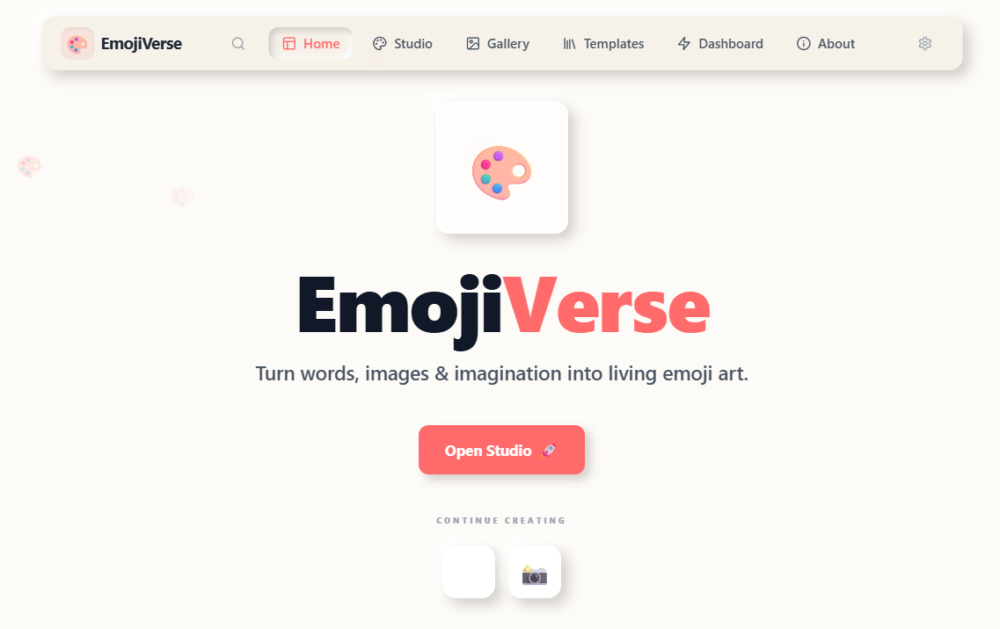
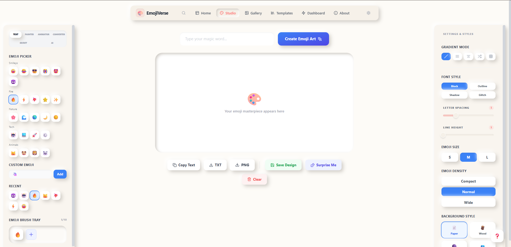
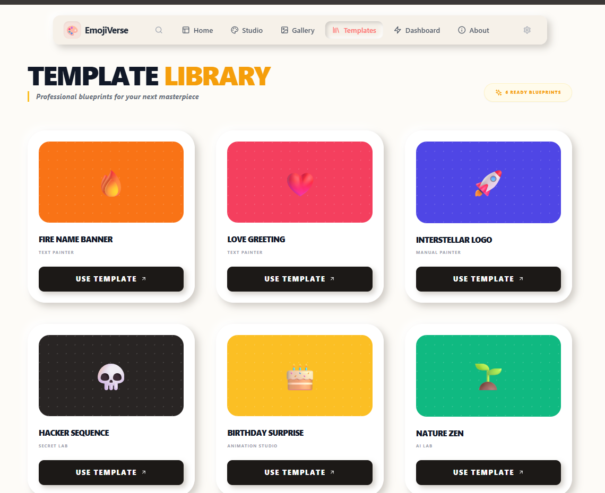

<div align="center">


  # 🎨 EmojiVerse

  ### A next-generation emoji creativity platform

  <p align="center">
    
  </p>

  "Turn words, images & imagination into living emoji art."

  ---

  [](https://reactjs.org/)
  [](https://vitejs.dev/)
  [](https://developer.mozilla.org/en-US/docs/Web/JavaScript)
  [](https://tailwindcss.com/)
  [](https://www.framer.com/motion/)
  <br/>
  [](https://opensource.org/licenses/MIT)
  [](https://github.com/phanicharan/EmojiVerse/stargazers)
  [](https://github.com/phanicharan/EmojiVerse/network/members)

</div>

## ✨ Application Preview

<div align="center">

  <table>
    <tr>
      <td align="center">
        
        <br />
        <b>🏠 Beautiful Skeuomorphic Landing Page</b>
      </td>
    </tr>
    <tr>
      <td align="center">
        
        <br />
        <b>🎨 Advanced Emoji Creation Studio</b>
      </td>
    </tr>
    <tr>
      <td align="center">
        
        <br />
        <b>📚 Creative Template Library</b>
      </td>
    </tr>
  </table>

</div>

## 🚀 Features

EmojiVerse is a premium skeuomorphic creative studio that combines the power of modern design with the fun of emojis.

| Feature | Description |
| :--- | :--- |
| **🎨 Emoji Text Painter** | Transform words into beautiful emoji pixel artwork using our custom 7x5 matrix engine. |
| **🖌 Emoji Painter** | Draw manually on a high-fidelity grid with a variety of emoji brushes and tools. |
| **✨ Animation Studio** | Bring your creations to life with Rain, Explosion, Wave, and Typewriter animations. |
| **📸 Image Converter** | Upload any image and watch it transform into a vibrant emoji mosaic instantly. |
| **🔐 Secret Lab** | Encode secret messages into emojis and generate ultra-secure emoji-based passwords. |
| **🤖 Emoji AI Lab** | Leverage rule-based intelligence for mood detection and smart emoji story generation. |
| **📚 Templates** | Jumpstart your creativity with a library of ready-made professional emoji blueprints. |
| **🏆 Dashboard** | Track your creative progress and unlock unique achievements as you create. |

## 🛠 Development Phases

<details open>
<summary><b>Project Roadmap</b></summary>

- [x] **Phase 0:** Foundation + Skeuomorphic UI System
- [x] **Phase 1:** Emoji Text Generation Engine
- [x] **Phase 2:** Manual Emoji Paint Studio
- [x] **Phase 3:** High-Fidelity Animation System
- [x] **Phase 4:** Image-to-Emoji Pixel Converter
- [x] **Phase 5:** Secret Lab (Encryption & Passwords)
- [x] **Phase 6:** Emoji AI Intelligence Modules
- [x] **Phase 7:** Production Platform & Achievement System

</details>

## 💻 Tech Stack

<div align="center">

| Area | Technologies |
| :--- | :--- |
| **Frontend** |    |
| **Animations** |  |
| **Storage** |  |
| **Processing** |   |

</div>

## 🏗 Architecture

EmojiVerse follows a clean, modular architecture designed for scalability and maintainability.

```text
EmojiVerse/
├── src/
│   ├── components/    # Atomic UI components & feature modules
│   ├── pages/         # Route-level view components
│   ├── utils/         # Core engines (Matrix, AI, Cipher, Export)
│   ├── hooks/         # Shared stateful logic & engine controllers
│   ├── animations/    # Framer Motion variants & presets
│   └── context/       # Global application state (Toast, etc.)
```

## ⚙️ Installation

Experience EmojiVerse on your local machine in just a few steps:

1. **Clone the repository**
   ```bash
   git clone https://github.com/phanicharan/EmojiVerse.git
   cd EmojiVerse
   ```

2. **Install dependencies**
   ```bash
   npm install
   ```

3. **Run development server**
   ```bash
   npm run dev
   ```

4. **Build for production**
   ```bash
   npm run build
   ```

## 🌟 Why EmojiVerse?

- ✔ **No Backend Needed:** Fully powered by client-side logic for maximum privacy and speed.
- ✔ **Skeuomorphic Experience:** Tactile UI that feels like a real physical workstation.
- ✔ **Creative AI Tools:** Rule-based intelligence for smart emoji compositions.
- ✔ **Advanced Export:** Save your art as PNG, TXT, or even animated GIFs.
- ✔ **Fully Responsive:** Create emoji art on any device, from desktop to mobile.

## 🔄 The Experience

<div align="center">

**Type Text** ➔ **Pick Emoji** ➔ **Generate Magic** ➔ **Animate** ➔ **Share** 🚀

</div>

## 🤝 Contribution

Contributions are what make the open source community such an amazing place to learn, inspire, and create. Any contributions you make are **greatly appreciated**.

1. Fork the Project
2. Create your Feature Branch (`git checkout -b feature/AmazingFeature`)
3. Commit your Changes (`git commit -m 'Add some AmazingFeature'`)
4. Push to the Branch (`git push origin feature/AmazingFeature`)
5. Open a Pull Request


<div align="center">

### If you like EmojiVerse, give it a ⭐!


</div>
